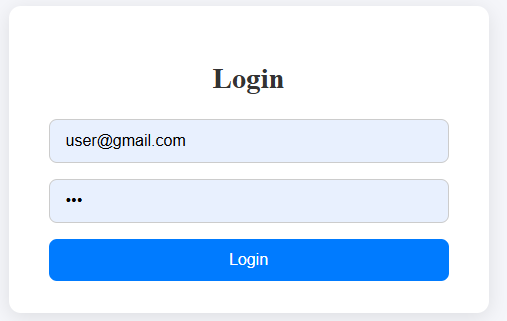
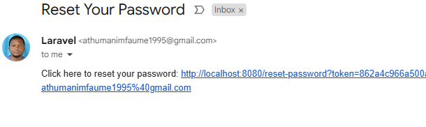
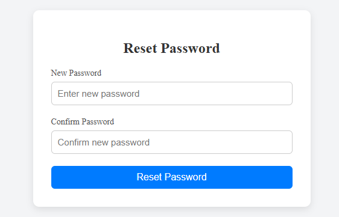
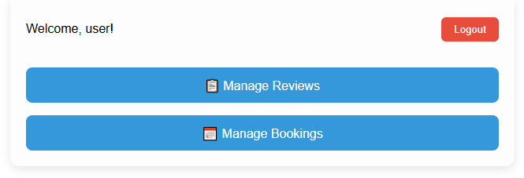
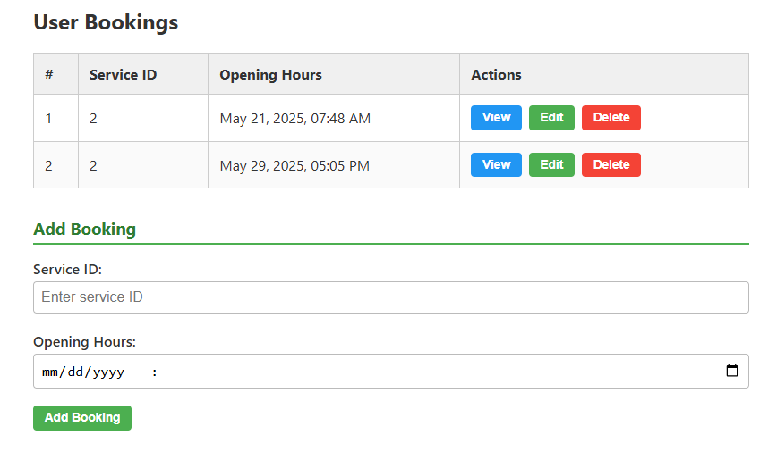

# Laravel + Vue Booking System

This is a **full-stack booking system** built with **Laravel (API)** as the backend and **Vue 3** as the frontend. The project is structured into two main directories:

- `backend/` → Laravel API for booking logic
- `frontend/booking_vue/` → Vue 3 application for user interface

---

## 🛠 Tech Stack

- **Backend**: Laravel 12, MySQL
- **Frontend**: Vue 3, Vite, Axios
- **Authentication**: Laravel Sanctum + Email Verification
- **API**: RESTful with token authentication

---

## 🚀 Features

- User registration & login (API-based with Sanctum)
- Booking management with validations
- Role-based access (Admin, User)
- Responsive Vue 3 SPA
- Email verification system
- Forget & reset password functionality
- Secure API access with Sanctum

---

## 📷 Screenshots

### 🔐 Login Page

### 📧 Email Verification Page

### ❓ Forget Password Page

### 🔁 Reset Password Page

### 📊 Dashboard

### 📝 Booking Form

---

## 📁 Project Structure

booking-vue-laravel/
│
├── backend/ # Laravel backend (API)
│ └── ...
│
├── frontend/booking_vue/ # Vue frontend (SPA)
│ └── ...
│
└── README.md # Project documentation

---

## 🔧 Installation

### 1. Clone the Repository

git clone https://github.com/athumaniMfaume/laravel-vue-booking.git
cd laravel-vue-booking

cd backend

# Install dependencies
composer install

# Create and configure .env
cp .env.example .env
php artisan key:generate

# Set DB credentials in .env, then:
php artisan migrate
php artisan serve

cd ../frontend/booking_vue

# Run development server
npm run serve

🔐 Authentication System
The system uses Laravel Sanctum for SPA authentication and includes:

Email verification link sent after registration.

Forget password flow:

User enters email → receives reset link.

Clicks link → sets new password securely.

All protected routes are guarded in both Laravel and Vue.

📦 Sample API Endpoints
Method	Endpoint	Description
POST	/api/login	Log in user
POST	/api/register	Register new user
POST	/api/forgot	Send password reset link
POST	/api/reset	Reset password
GET	/api/verify	Email verification
GET	/api/services	List available services
POST	/api/bookings	Create a booking
GET	/api/bookings/me	Get bookings by user

📬 Contact
GitHub: athumaniMfaume/laravel-vue-booking

Email: athumanimfaume1995@gmail.com

